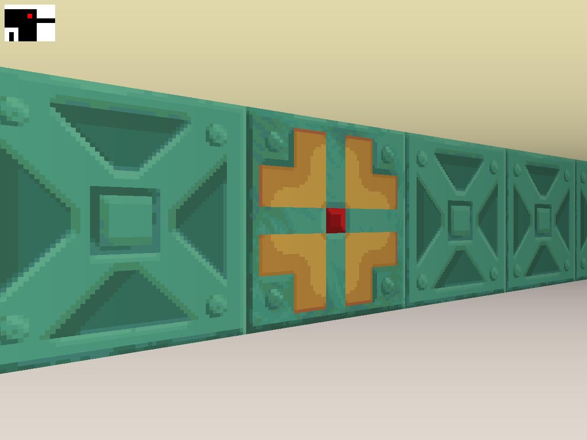
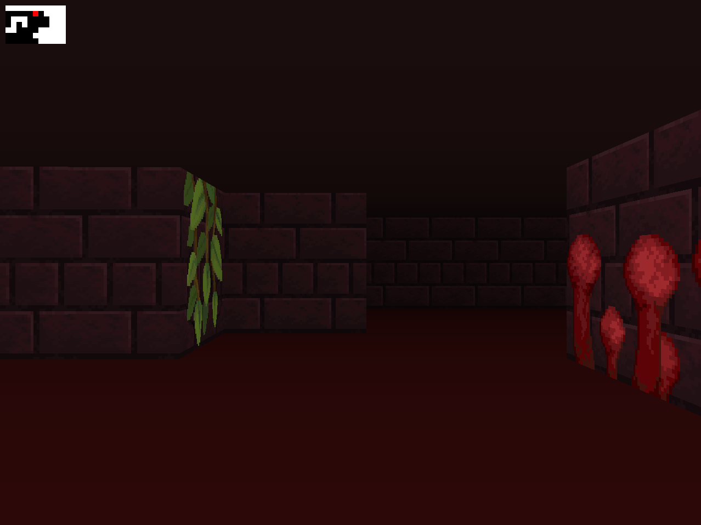
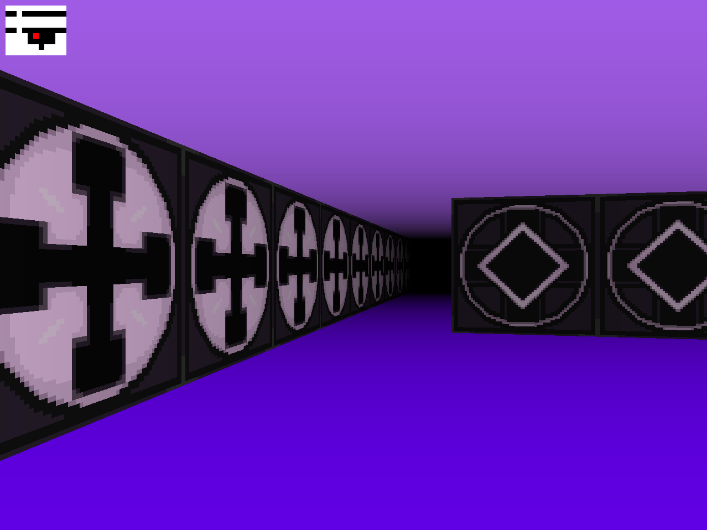
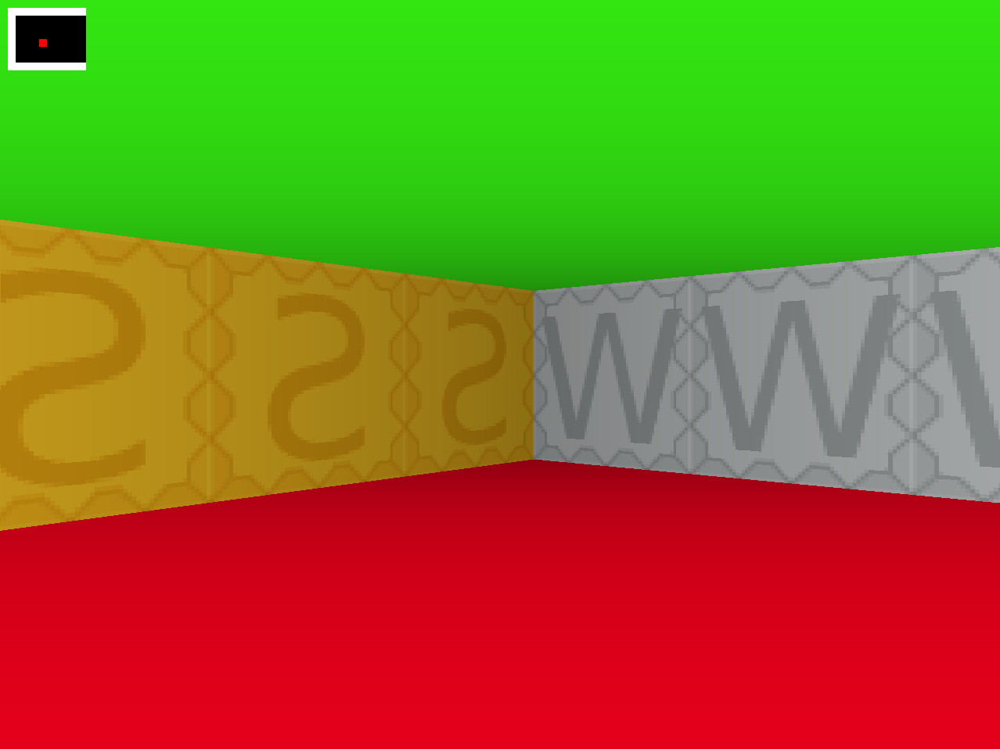

# 🎮 Cub3D - 3D Raycasting Engine

<div align="center">
  
  
  
  <br><br>
</div>

<div align="center">
  
  
  <br><br>
</div>

<details open>
<summary><b>🚀 Overview</b></summary>

The **Cub3D** project is a 3D graphics engine inspired by the iconic Wolfenstein 3D game, built from scratch using raycasting techniques. This project demonstrates advanced concepts in computer graphics, mathematics, and optimization in the C language.

The engine renders a 3D maze from a 2D map, allowing the player to navigate through it in first-person perspective with textured walls, ceiling and floor rendering, collision detection, and optional features like animated doors and a minimap.
</details>

<details>
<summary><b>✨ Features</b></summary>

- 🎮 Smooth first-person movement with WASD keys and mouse rotation
- 🗺️ Custom map loading from .cub files with texture path definitions
- 🧱 Textured walls with different textures for each direction (North, South, East, West)
- 🌈 Customizable ceiling and floor colors
- 🚶‍♂️ Collision detection for realistic wall interactions
- 🚪 Animated doors (bonus feature)
- 🔍 Dynamic distance-based fog effect for depth perception
- 📍 Minimap for easy navigation (bonus feature)
- ⚙️ Optimized raycasting algorithm for smooth performance
</details>

<details>
<summary><b>📊 Game Elements</b></summary>

| Element           | Symbol | Description                                  |
|-------------------|:------:|----------------------------------------------|
| Player Direction  | N/S/E/W| Player starting position and facing direction|
| Wall              |   1    | Solid wall that cannot be passed through     |
| Empty space       |   0    | Area where the player can move freely        |
| Door (bonus)      |   2    | Interactive door that can be opened/closed   |
| Door space (bonus)|   3    | Opening where a door was previously located  |
| Texture paths     |  NO/SO/WE/EA | File paths to wall textures for each direction |
| Colors            |  F/C   | RGB color definitions for floor and ceiling  |

</details>

<details>
<summary><b>🛠️ Function Overview</b></summary>

<details>
<summary><b>🔑 Main Functions</b></summary>

| Function | Description |
|----------|-------------|
| `main` | Entry point of the program, initializes the engine |
| `render` | Core rendering loop that updates the display each frame |
| `key_press` | Manages keyboard input for movement and actions |
| `mouse_move` | Handles mouse rotation (bonus feature) |
| `process_ray_casting` | Implements the DDA raycasting algorithm |

</details>

<details>
<summary><b>⚙️ Helper Functions</b></summary>

| Function | Description |
|----------|-------------|
| `check_args` | Validates command-line arguments and file extension |
| `check_map_valid` | Ensures the map meets all required specifications |
| `flood_fill` | Validates map boundaries using a flood fill algorithm |
| `calculate_texture_coordinates` | Maps textures to wall slices |
| `load_textures` | Loads wall textures and optional animated doors |
| `rotate_player` | Updates player direction vectors during rotation |
| `draw_minimap` | Renders the overhead minimap view (bonus feature) |
| `clean_exit` | Frees allocated resources when exiting the program |

</details>
</details>

<details>
<summary><b>🛠️ Installation</b></summary>

```bash
# Clone the repository
git clone https://github.com/Flingocho/cub3d.git

# Navigate to the directory
cd cub3d

# Initialize submodules to get dependencies
git submodule init
git submodule update

# Build the game
make

# Run the game with a map
./cub3d maps/map.cub

# Run the bonus version with doors and minimap
make bonus
./cub3d_bonus maps/map.cub
```

### Project Structure

The project follows a modern directory structure:

```
cub3d/
├── include/                 # Header files directory
│   ├── cub3d.h              # Main header with function prototypes
│   ├── structs.h            # Structure definitions
│   └── vals.h               # Constant value definitions
├── src/                     # Source files directory
│   ├── main.c               # Main program implementation
│   ├── init_vars.c          # Initialization functions
│   ├── key_mapping.c        # Key input handling
│   ├── moves.c              # Player movement functions
│   ├── check_args_*.c       # Argument and map validation
│   ├── check_map_*.c        # Map validation and processing
│   ├── ray_casting_*.c      # Raycasting engine components
│   ├── mini_map.c           # Minimap rendering (bonus)
│   ├── load_textures*.c     # Texture loading functions
│   └── cleaner*.c           # Memory cleanup functions
├── dependencies/            # External libraries
│   ├── libft/               # Custom C standard library functions
│   └── mlx/                 # MiniLibX graphics library
├── maps/                    # Game maps
│   └── map.cub              # Example map
├── textures/                # Game assets
│   ├── wall_*.xpm           # Wall textures for each direction
│   ├── door_*.xpm           # Door animation frames (bonus)
│   └── title*.xpm           # Title screen textures
├── images/                  # Screenshots and documentation images
└── Makefile                 # Build automation
```

</details>

<details>
<summary><b>🎮 Controls</b></summary>

| Key | Action |
|-----|--------|
| W   | Move Forward |
| A   | Strafe Left |
| S   | Move Backward |
| D   | Strafe Right |
| ←   | Rotate Left |
| →   | Rotate Right |
| Space | Toggle Door (bonus) |
| ESC | Exit Game |
| Mouse | Camera Rotation (bonus) |

</details>

<details>
<summary><b>🗺️ Map Format</b></summary>

Maps are defined in `.cub` files with the following conventions:

First, texture paths and colors are defined:
```
NO ./textures/wall_north.xpm
SO ./textures/wall_south.xpm
WE ./textures/wall_west.xpm
EA ./textures/wall_east.xpm

F 220,100,0    # Floor color (RGB)
C 225,30,0     # Ceiling color (RGB)
```

Then, the map grid is defined:
- `1`: Wall
- `0`: Empty space
- `N/S/E/W`: Player starting position and facing direction (only one allowed)
- `2`: Door (bonus feature)
- `3`: Open door space (bonus feature)

Example map:
```
        1111111111111111111111111
        1000000000110000000000001
        1011000001110000002000001
        1001000000000000000000001
111111111011000001110000000000001
100000000011000001110111111111111
11110111111111011100000010001
11110111111111011101010010001
11000000110101011100000010001
10002000000000001100000010001
10000000000000001101010010001
11000001110101011111011110N0111
11110111 1110101 101111010001
11111111 1111111 111111111111
```

The map must be enclosed by walls and contain exactly one player starting position.
</details>

<details>
<summary><b>🔧 Dependencies</b></summary>

- **libft**: Custom implementation of C standard library functions
- **minilibx-linux**: Simple X-Window graphics API

All dependencies are included as submodules in the project and are compiled automatically through the Makefile.
</details>

<details>
<summary><b>🌟 Key Learning Outcomes</b></summary>

- 🎯 **3D Graphics Fundamentals**: Understanding of raycasting techniques to create 3D environments from 2D maps
- 🔢 **Applied Mathematics**: Implementation of vector mathematics, trigonometry, and projection calculations
- 🖥️ **Low-level Graphics Programming**: Direct pixel manipulation, texture mapping, and frame rendering using MiniLibX
- 🧩 **Algorithmic Thinking**: Implementation of Digital Differential Analysis (DDA) for efficient ray-wall intersection detection
- 🔍 **Memory Management**: Efficient resource allocation and cleanup to prevent memory leaks in a graphics-intensive application
- 🧠 **Event-driven Programming**: Creating responsive controls through keyboard and mouse event handling
- 🚀 **Performance Optimization**: Techniques like view distance culling and efficient rendering to maintain consistent frame rates
- ✨ **Visual Effects**: Implementation of distance-based fog, texture mapping, and animation
- 🔧 **Project Architecture**: Organization of complex graphics code into maintainable components
</details>

<details>
<summary><b>🖼️ Screenshots</b></summary>

<div align="center">
  
  <p><em>3D view with textured walls and distance-based fog effect</em></p>
  
  
  <p><em>Testing room + minimap view (bonus)</em></p>
</div>
</details>

<details>
<summary><b>📜 License</b></summary>

This project is part of the 42 School curriculum and is provided under the [MIT License](LICENSE).
</details>

---

<div align="center">
  Created with ❤️ by <a href="https://github.com/Flingocho">Flingocho</a> and <a href="https://github.com/nisp3ro">nisp3ro-c</a>
</div>